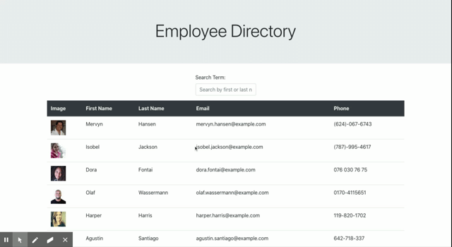

# Employee Directory

## Description 

* As a user, I want to be able to view my entire employee directory at once so that I have quick access to their information.

## Business Context

An employee or manager would benefit greatly from being able to view non-sensitive data about other employees. It would be particularly helpful to be able to filter employees by name.

## Table of Contents

* [Installation](#installation)
* [Usage](#usage)
* [Contributing](#contributing)

## Technologies used

* Javascript
* Node.js
* React.js

## Installation

The app is deployed on Heroku: [Employees](https://mysterious-lake-10486.herokuapp.com/)
## Usage

Given a table of random users, when the user loads the page, a table of employees should render. 

The user should be able to:

  * Sort the table by at least one category

  * Filter the users by at least one property.

 

## Contributing 

yes you can make contributions to this project and report any issues. If you would like to make a contribution to the application, the green badge above will direct you to the issues page for this repository and you can submit your issue there.

## License

This project is licensed under ISC

## Acknowledgements
I used this repository to learn about badges: 
[dwyl repo-badges](https://github.com/dwyl/repo-badges)

## Authors

**This project was created by:**
* Jose-lco 
  * Contact info: [Linkedin profile](https://www.linkedin.com/in/josephine-ndungu-a0a441160)
